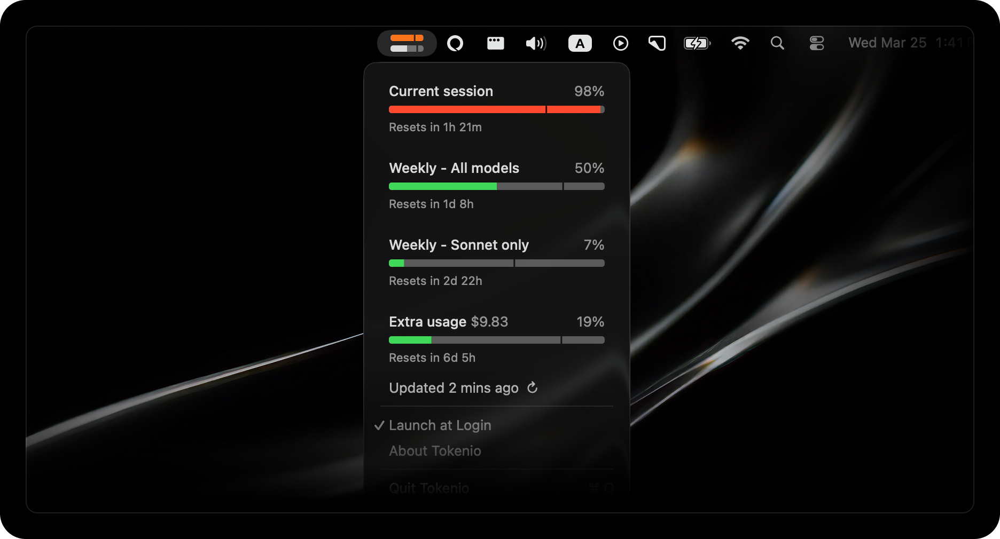

# Tokenio

Tiny macOS menu bar app that shows your Claude AI usage at a glance.



## What it shows

- **Current session** (5-hour window) — usage % with pace indicator
- **Weekly — All models** (7-day window)
- **Weekly — Sonnet only** (7-day window)
- **Extra usage** — dollar amount and utilization

Each bar is color-coded: **green** = normal, **orange** = near limit (≥90%), **red** = at limit. The transparent notch shows where you are in the time window.

The menu bar icon shows two small bars: the top bar is your current session usage, and the bottom bar is your weekly usage.

## Install

Download the latest `.zip` from [Releases](https://github.com/elomid/tokenio/releases), unzip, and drag `Tokenio.app` to your Applications folder.

Requires macOS 13 (Ventura) or later, and **Claude Code CLI** (must be installed and logged in). Designed for Claude Pro and Max subscribers.

Tokenio enables Launch at Login on first run — you can toggle this from the menu.

## Auth

Tokenio uses Claude Code CLI's OAuth credentials — no separate login required. On first launch, click **Connect to Claude Code…** in the menu. macOS will prompt once to allow Tokenio to read Claude Code's keychain — click **Always Allow**. The imported token is stored locally and all background refreshes run without touching Claude Code's credentials again.

The imported access token expires after several hours. When it does, Tokenio keeps showing your last-known usage data and displays a **Reconnect to Claude Code…** option. Click it to import a fresh token — one keychain prompt, done.

## Build from source

```bash
git clone https://github.com/elomid/tokenio.git
cd tokenio
xcodebuild -project Tokenio.xcodeproj -scheme Tokenio -configuration Release -derivedDataPath build build
```

The built app will be in `build/Build/Products/Release/Tokenio.app`.

## How it works

Tokenio imports a Claude Code OAuth token once via an explicit Connect action (the only time it reads Claude Code's keychain). It then uses that token to fetch usage data from Anthropic's OAuth API every 5 minutes. The API is undocumented and may change without notice.

Usage data is only exchanged with `api.anthropic.com`. The imported token is stored in the app's local preferences — no credentials leave your machine.

## Known limitations

- Relies on Claude's internal API, which may break when Anthropic changes it.
- Requires Claude Code CLI — does not work with a standalone Claude account.
- Imported access token expires after several hours. Click Reconnect in the menu when this happens.
- If you belong to multiple organizations, usage shown is for your primary account.

## License

MIT
