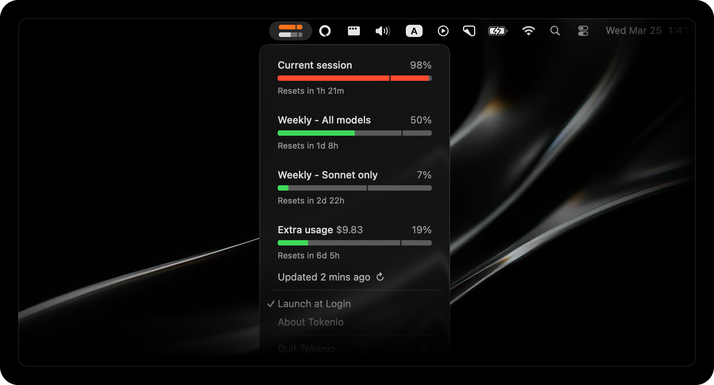

# Tokenio

Tiny macOS menu bar app that shows your Claude and Codex usage at a glance.



## What it shows

- **Current session** (5-hour window) — usage % with pace indicator
- **Weekly — All models** (7-day window)
- **Weekly — Fable only** (7-day window)
- **Codex weekly** — purple bar, using your existing Codex login
- **Extra usage** — dollar amount and utilization

Claude session and overall weekly bars are monochrome, Fable is blue, and Codex is purple. The transparent notch shows where you are in the time window.

The menu bar icon shows four stacked bars: Claude session, Claude weekly, Fable weekly (blue), and Codex weekly (purple). Menu bars use matching colors. An unavailable metric has an empty bar; check the menu for connection errors.

## Install

**[Download the latest release](https://github.com/elomid/tokenio/releases/latest)** — get `Tokenio.zip`, unzip, and drag `Tokenio.app` to Applications.

Direct link (always the newest build): https://github.com/elomid/tokenio/releases/latest/download/Tokenio.zip

Requires macOS 13 (Ventura) or later. Designed for Claude Pro and Max subscribers.

Tokenio enables Launch at Login on first run — you can toggle this from the menu.

## Update

1. Quit Tokenio (menu → Quit Tokenio).
2. [Download the latest zip](https://github.com/elomid/tokenio/releases/latest/download/Tokenio.zip).
3. Unzip and replace `Tokenio.app` in Applications.
4. Reopen Tokenio. Your login is kept.

To get notified when a new version ships, use **Watch → Custom → Releases** on this repo.

## Auth

On first launch, Tokenio shows a welcome screen. Click **Log in to Claude** to sign in with your Claude account via email verification. Google sign-in is not supported — use "Continue with email" instead.

Your session is stored locally and persists across restarts. Claude does not require a CLI; Codex setup is described below.

## Build from source

```bash
git clone https://github.com/elomid/tokenio.git
cd tokenio
xcodebuild -project Tokenio.xcodeproj -scheme Tokenio -configuration Release -derivedDataPath build build
```

The built app will be in `build/Build/Products/Release/Tokenio.app`.

## How it works

Tokenio signs you in via claude.ai and stores a session key locally. It then fetches usage data from Claude's API every 5 minutes. The API is undocumented and may change without notice.

Claude usage is fetched from `claude.ai`, with its session key stored in Tokenio’s own macOS Keychain entry. Codex usage is fetched by the local Codex CLI using its existing authentication.

## Known limitations

- Relies on Claude's internal API, which may break when Anthropic changes it.
- Google sign-in is not supported — use email verification instead.
- If you belong to multiple organizations, usage shown is for your primary account.

## License

MIT

## Codex setup

Install the Codex CLI and sign in with `codex login`. Tokenio reads the main Codex weekly quota through `codex app-server`, independently of Claude, every five minutes and on wake or manual refresh. It does not start a model turn. The CLI manages authentication. Last successful usage is cached; fetch errors remain visible in the menu.
